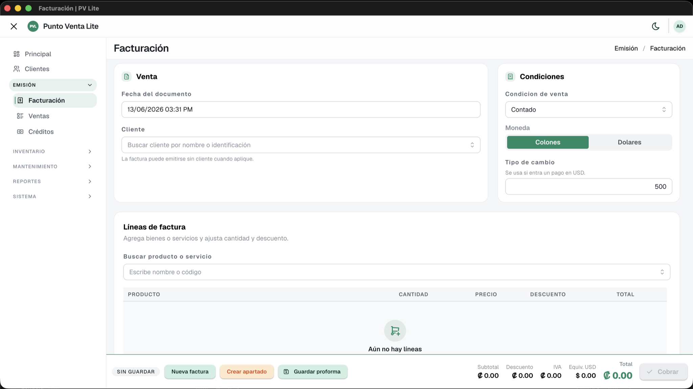

# PuntoVenta Lite

> Punto de venta de escritorio, **gratis y offline**. Facturación simple para un negocio, con tus datos siempre en tu máquina.


PuntoVenta Lite es una aplicación de punto de venta pensada para comercios pequeños: factura, controla inventario y cobra sin depender de internet ni de una suscripción. Todo corre local sobre **SQLite** — sin nube, sin cuentas externas, sin mensualidad.

<picture>
  <source media="(prefers-color-scheme: dark)" srcset="assets/app-dark.png">
  
</picture>

## ✨ Características

- **Facturación** completa: facturas, proformas, apartados y notas de crédito/débito.
- **Ventas a crédito** con abonos (sin límites ni aging — simple).
- **Inventario** con stock por producto y bandeja de movimientos para trazabilidad.
- **Cajas y vendedores** opcionales por documento.
- **Comprobantes en PDF** (factura y ticket) e **impresión térmica ESC/POS** (58/80 mm, corte y gaveta).
- **Reporte de ventas** exportable a Excel.
- **Multiusuario** con roles y permisos (RBAC).
- **100 % offline** — tu base de datos vive en tu equipo.
- **Escritorio multiplataforma**: Windows y macOS.

## 🧱 Stack

| Capa       | Tecnología                                               |
| ---------- | -------------------------------------------------------- |
| Backend    | .NET 10 · FastEndpoints · Mediator · EF Core 10 + SQLite |
| Frontend   | Next.js 16 · React 19 · Mantine v9 · Tailwind 4          |
| Escritorio | Electron 42                                              |
| Documentos | QuestPDF (PDF) · ClosedXML (Excel)                       |
| Seguridad  | JWT + refresh token opaco · BCrypt · RBAC                |

Arquitectura limpia por capas: `Domain → Application → Infrastructure → API`.

## 📥 Instalación (usuarios)

Descargá el instalador para tu sistema desde la página de [**Releases**](../../releases).

Al primer inicio se crea un usuario administrador por defecto:

| Usuario | Contraseña  |
| ------- | ----------- |
| `admin` | `admin1234` |

> Se te pedirá cambiar la contraseña en el primer ingreso.

## 🛠️ Desarrollo

### Requisitos

- [.NET SDK 10](https://dotnet.microsoft.com/download)
- [Node.js 20+](https://nodejs.org) y [pnpm](https://pnpm.io)

### Configuración

Copiá los archivos de ejemplo (los reales están ignorados por git):

```bash
# Backend
cp src/PuntoVenta.API/appsettings.example.json src/PuntoVenta.API/appsettings.Development.json

# Frontend
cp src/PuntoVenta.Web/.env.example src/PuntoVenta.Web/.env.local
```

En `appsettings.Development.json` poné un `Jwt:SecretKey` (32 bytes en base64):

```bash
openssl rand -base64 32
```

### Correr

```bash
# Backend (http://localhost:5159)
dotnet run --project src/PuntoVenta.API

# Frontend (http://localhost:3000)
cd src/PuntoVenta.Web && pnpm install && pnpm dev
```

### Pruebas

```bash
dotnet test                                   # backend (xUnit)
cd src/PuntoVenta.Web && pnpm test:run        # frontend (vitest)
```

### Migraciones EF

```bash
dotnet ef migrations add <Nombre> \
  --project src/PuntoVenta.Infrastructure \
  --startup-project src/PuntoVenta.API
```

## 📦 Build de escritorio

```bash
cd src/PuntoVenta.Desktop
pnpm install
pnpm dist:mac    # o dist:win
```

El bundle empaqueta el API .NET + Next standalone + Electron, con SQLite en el directorio de datos del usuario.

## 📄 Licencia

Distribuido bajo licencia [MIT](LICENSE).
